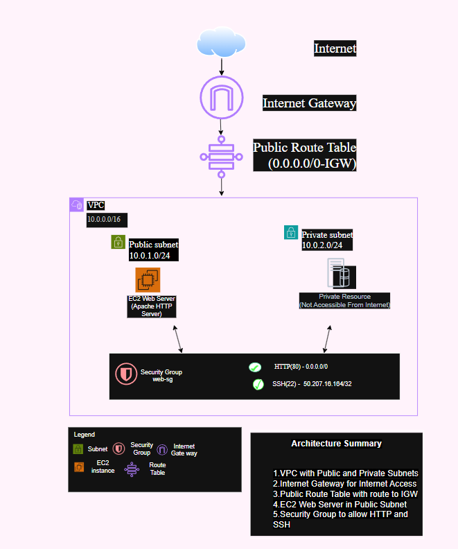

# Secure AWS Multi-Tier Architecture with Terraform

## Project Overview

This project demonstrates how to provision AWS networking infrastructure and deploy an Apache web server using Terraform Infrastructure as Code (IaC).

The environment contains a custom VPC, public and private subnets, an Internet Gateway, a public route table, a security group, and an Amazon EC2 instance.

> The private subnet is provisioned for future application or database resources. The current Apache web server runs in the public subnet.

## Architecture Diagram



## Architecture

```text
Internet
   |
Internet Gateway
   |
Public Route Table
   |
Public Subnet (10.0.1.0/24)
   |
EC2 Apache Web Server

Private Subnet (10.0.2.0/24)

VPC: 10.0.0.0/16
```

## AWS Resources Created

* Custom VPC: `10.0.0.0/16`
* Internet Gateway
* Public Subnet: `10.0.1.0/24`
* Private Subnet: `10.0.2.0/24`
* Public Route Table
* Route to the Internet Gateway
* Route Table Association
* EC2 Security Group
* Amazon EC2 Instance
* Apache HTTP Web Server

## Technologies Used

* Amazon Web Services
* Terraform
* Amazon VPC
* Amazon EC2
* Apache HTTP Server
* Git and GitHub
* Visual Studio Code
* PowerShell

## Security Configuration

The security group allows:

* HTTP traffic on port `80`
* SSH traffic on port `22`
* Outbound traffic required by the EC2 instance

For a production environment, SSH access should be restricted to a trusted IP address instead of allowing access from `0.0.0.0/0`.

## Project Structure

```text
secure-aws-multi-tier-architecture/
├── diagrams/
│   └── aws-architecture.png
├── screenshots/
│   ├── 01-vpc.png
│   ├── 02-subnets.png
│   ├── 03-route-table.png
│   ├── 04-security-group.png
│   ├── 05-ec2-instance.png
│   └── 06-working-website.png
├── terraform/
│   ├── main.tf
│   ├── outputs.tf
│   ├── provider.tf
│   └── variables.tf
├── .gitignore
└── README.md
```

## Prerequisites

Before deploying this project, install and configure:

* AWS CLI
* Terraform
* Git
* An AWS account
* An EC2 key pair named `terraform-key`

Verify the installations:

```bash
aws --version
terraform -version
git --version
```

Verify AWS authentication:

```bash
aws sts get-caller-identity
```

## Deployment Instructions

Open a terminal and navigate to the Terraform folder:

```bash
cd terraform
```

Initialize Terraform:

```bash
terraform init
```

Format and validate the configuration:

```bash
terraform fmt
terraform validate
```

Review the resources Terraform will create:

```bash
terraform plan
```

Deploy the infrastructure:

```bash
terraform apply
```

Enter `yes` when Terraform requests confirmation.

After deployment, Terraform displays the EC2 public IP address:

```text
web_server_public_ip = "PUBLIC-IP-ADDRESS"
```

Open the following address in a browser:

```text
http://PUBLIC-IP-ADDRESS
```

## Deployment Result

The Apache web server was successfully deployed and made available through the EC2 instance's public IP address.

The webpage displays:

```text
Secure AWS Multi-Tier Architecture Deployed Successfully
```

## Project Screenshots

### VPC


### Public and Private Subnets


### Public Route Table


### Security Group


### EC2 Instance


### Working Apache Website


## Skills Demonstrated

* AWS networking
* Infrastructure as Code
* Terraform resource management
* VPC and subnet design
* Route table configuration
* Security group configuration
* EC2 deployment
* Linux web server automation
* Git and GitHub version control
* Cloud infrastructure troubleshooting

## Cleanup

To avoid unexpected AWS charges, destroy the resources when they are no longer required:

```bash
terraform destroy
```

Enter `yes` when Terraform requests confirmation.

## Future Improvements

* Deploy EC2 instances in private subnets
* Add an Application Load Balancer
* Add an Auto Scaling Group
* Configure a NAT Gateway
* Add HTTPS with AWS Certificate Manager
* Restrict SSH access to a trusted IP address
* Store Terraform state remotely using Amazon S3
* Add DynamoDB state locking
* Add CI/CD validation with GitHub Actions

## Author

**Venkatasai Kumar Potla**

Network Engineer | AWS | Terraform | Cloud Security | Automation | CCNA
